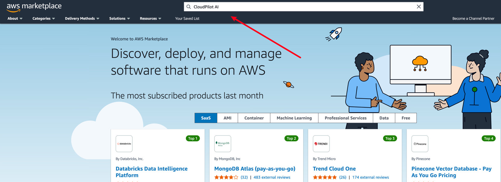
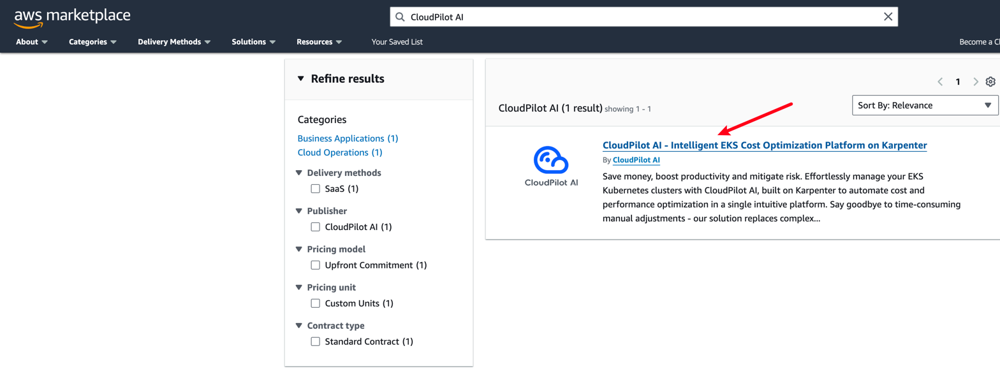
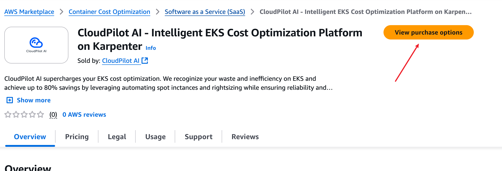
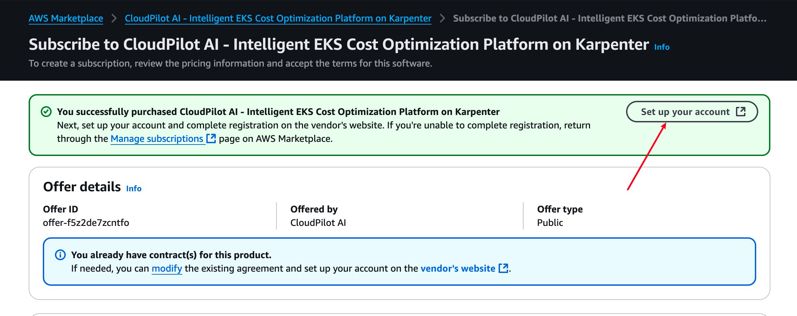

import { Callout } from 'nextra/components'

# AWS Marketplace Subscription

This guide provides step-by-step instructions for subscribing to CloudPilot AI through the AWS Marketplace. After completing these steps, your subscription will become active, and all management costs associated with AWS clusters in your account will be billed through AWS Marketplace.

## Step 1: Start Your Subscription to CloudPilot AI

First, log in to your AWS account, then visit the AWS Marketplace. Enter `CloudPilot AI` in the search bar at the top and press Enter.

Click on CloudPilot AI to navigate to the product detail page. Here, you can review detailed information about CloudPilot AI.

## Step 2: Subscribe to CloudPilot AI

Once you've reviewed the product details, click View purchase options to begin subscribing to CloudPilot AI.

Choose either a monthly or annual subscription plan and enable Auto-renewal.

## Step 3: Link Your AWS Account with Your CloudPilot AI Account

After subscribing, you'll see the following prompt on the product detail page:

lick this button, and you'll be redirected to the CloudPilot AI console. If you've recently logged into the console, your account will automatically link to the logged-in user. Otherwise, you'll need to log in or register for a new account.

Once logged in, your CloudPilot AI account will link to the appropriate AWS account, activating your billing and services.

<Callout type="info">
    You can later find your CloudPilot AI billing details listed in your AWS Billing Dashboard.

    CloudPilot AI will automatically push the ***average core count of nodes managed by CloudPilot AI*** to AWS Marketplace to facilitate billing.
</Callout>
