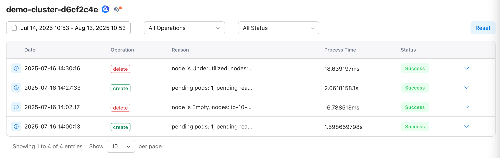
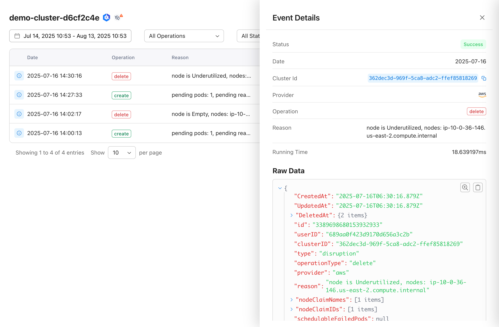
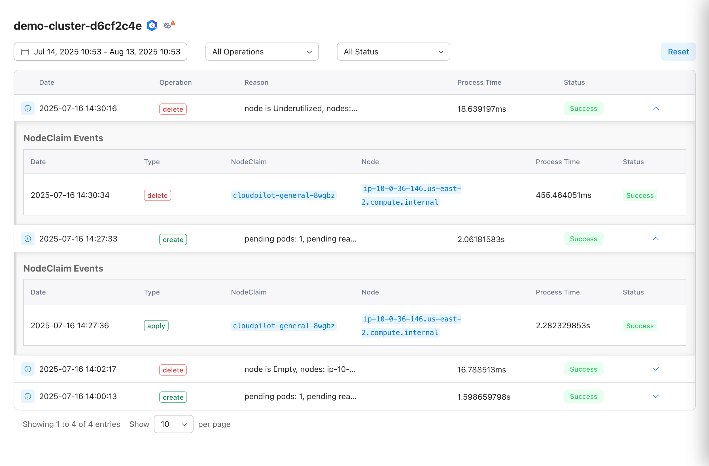
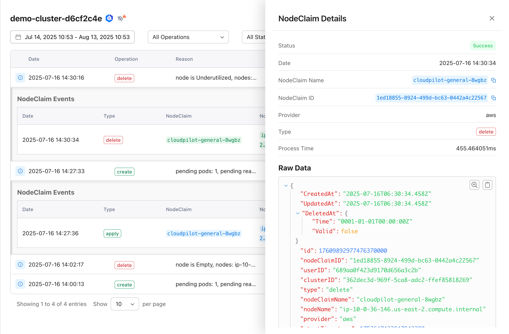

# Karpenter Events

CloudPilot AI surfaces Karpenter controller (disruption, provisioner) events and NodeClaim events in a single, correlated view to visualize node lifecycles, explain create/delete decisions, and diagnose failed node operations.

## Controller events

Controller events are grouped by controller type (disruption, provisioner) and operation (create, replace, delete).

Key fields:

| Parameter | Description | Value |
|-----------|-------------|---------|
| type | Karpenter controller type | disruption, provisioner |
| operationType | Operation performed by the controller | create, replace, delete |
| reason | Reason the event was triggered |  |
| nodeClaimNames | Related NodeClaim names |  |
| nodeClaimIDs | Related NodeClaim IDs |  |
| schedulableFailedPods | Pods that failed scheduling |  |
| processTime | Processing time |  |
| status | Operation outcome | true, false |
| errs | Error details (if any) |  |
| data | Raw event payload and details |  |

### example

#### controller event view

#### controller event details

## NodeClaim events

NodeClaim events currently include Apply and Delete operations.

Key fields:

| Parameter | Description | Value |
|-----------|-------------|---------|
| nodeClaimName | NodeClaim name |  |
| nodeClaimID | NodeClaim ID |  |
| type | NodeClaim event type | apply, delete |
| nodeName | Associated node name |  |
| processTime | Processing time |  |
| status | Operation outcome | true, false |
| errs | Error details (if any) |  |
| data.providerInfo.providerReq | Original request sent to the cloud provider |  |
| data.providerInfo.providerResp | Original response returned by the cloud provider |  |
| data.nodeClass | Related NodeClass |  |
| data.nodeClaim | NodeClaim resource associated with the event |  |

### example

#### controller event and nodeclaim event view

#### nodeclaim event details

---

Use Karpenter events to quickly spot node lifecycle changes and speed up troubleshooting. For further assistance, check out the [CloudPilot Documentation](https://docs.cloudpilot.ai/) or reach out to [our support team](https://www.cloudpilot.ai/en/contact/).
