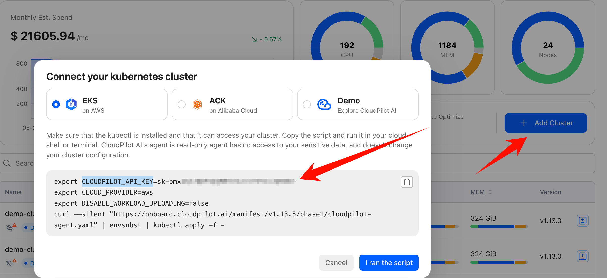

> ⚠️ This is a temporary solution. We will introduce a more comprehensive user management and permission system in the future.
> Please keep your API Keys secure and do not share them with others.

# Get API Keys
To use CloudPilot AI's API, you need to obtain API Keys. Please follow these steps:

1. Log in to the [CloudPilot AI Console](https://console.cloudpilot.ai).
2. Click `Add Cluster`.
3. Copy the corresponding API KEY (**CLOUDPILOT_API_KEY**) from the script.

