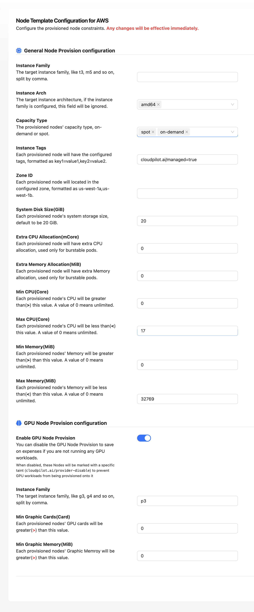
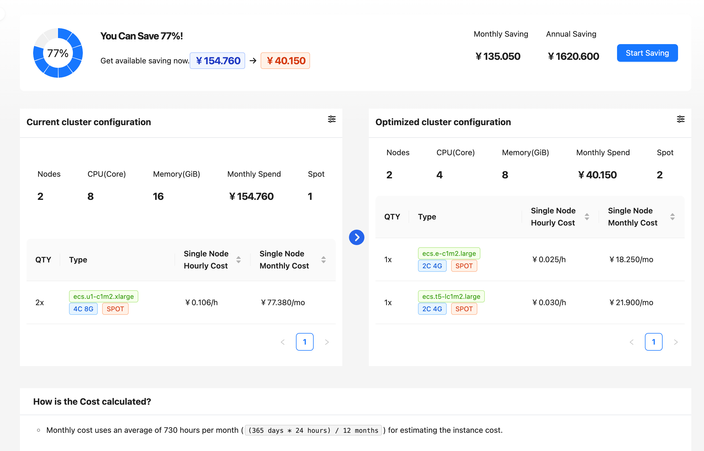
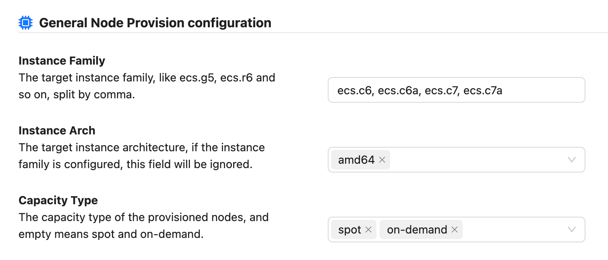
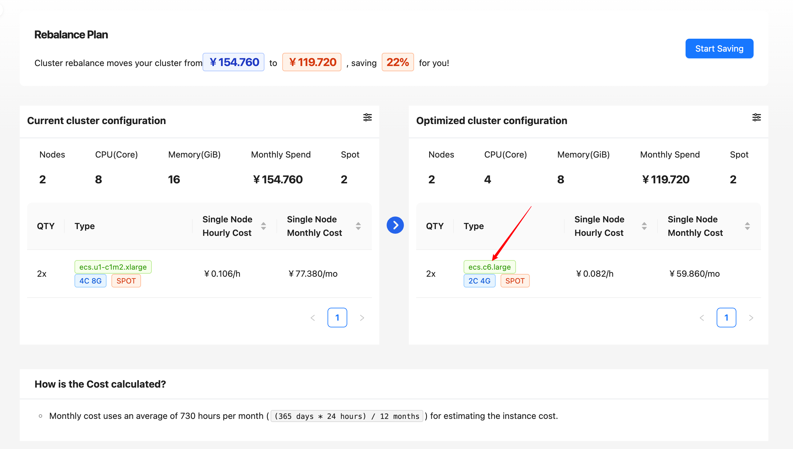

# Node template Configuration Guide

# 1. Configuration Overview

Node template Configuration allows you to customize various settings of the nodes in your system to optimize performance, cost-effectiveness and reliability. The main configuration options are General Node Provision configuration, GPU Node Provision configuration.

# 2. General Node Provision configuration

Configure basic attributes of general computing nodes, including instance family, architecture, capacity type, label, availability zone, system disk size, and CPU/memory resource constraints. All configurations take effect dynamically, taking into account performance, cost, and O&M resiliency, and are suitable for scenarios requiring fine-grained control of node specifications and mixed loads.

## 2.1 Example Selection and Architecture

### 2.1.1 Instance Family

Supports specifying instance types (e.g., t3, m5) and allows multiple choices (comma-separated) for matching scenarios with different computational requirements.

### 2.1.2 Instance Arch

Automatically recognizes cluster architecture, also manually configures, allows multiple selection of amd64, arm64

## 2.2 Capacity Types and Deployment Strategies

### 2.2.1 Capacity Type

Either on-demand or spot, both are selected by default

### 2.2.2 Zone ID

Specify the specific region in which the node is deployed (e.g. us-west-ta) to support multi-region inputs to enhance disaster recovery or meet compliance requirements.

## 2.3 Resource allocation and constraints

### 2.3.1 CPU/memory limit

#### 2.3.1.1 Min/Max CPU

Limit the number of CPU cores on a single node (maximum of 17 cores in the example, minimum of 0 cores).

#### 2.3.1.2 Min/Max Memory

Limit the memory size (maximum in the example is 32769 MiB, about 32 GiB, minimum 0 GiB).

#### 2.3.1.3 Extra CPU/Memory Allocation

Support for reserving extra CPU (m Core) and memory (Mi B) for bursty tasks is not enabled in the example (both 0).

## 2.4 Storage and Instance Tags

### 2.4.1 System Disk Size

Default 20 GiB, user adjustable on demand, example stays at default.

### 2.4.2 Instance Tags

Mark nodes in key=value format (e.g., cloudpilot.ai/managed=true) for resource classification, billing, or automated management.

# 3. GPU Node Provision Configuration

Enable or disable GPU node provisioning and specify GPU instance family, minimum number of graphics cards and graphics memory requirements. It is suitable for scenarios that require dynamic management of GPU resources, balancing high-performance computing and cost, especially for tasks such as deep learning and graphics rendering, which use GPUs intermittently or require fine-grained control of graphics memory allocation.

## 3.1 Enable GPU Node Provision

GPU node provisioning can be enabled/disabled at any time, and when disabled nodes are marked with a specific rate, preventing GPU task scheduling for cost savings.

### 3.1.1 Instance Family

Support for specifying GPU instance families (e.g. p3, g4), configured as p3 in the example.

### 3.1.2 Resource Constraint

#### 3.1.2.1 Min Graphic Cards(Card)

Limit the number of GPU cards in a single node, set to 0 (no limit) in the example.

#### 3.1.2.2 Min Graphic Memory(MiB)

Limit the video memory capacity of a single node, set to 0 (no limit) in the example.

# 4. Example Configuration

## 4.1 Default rebalance effect

> 💡 Architecture Description
>
> Differences in the rebalancing effect of the system during the initial deployment phase (when only cloudpilot-agent is installed) versus the full optimization environment (when all components are enabled) arise from:
> - **Component dependency**: full optimization capability requires loading of supporting components such as cloudpilot-optimizer, cloudpilot-webhook, etc.
> - **Functionality evolution**: the basic version of the agent only provides monitoring capabilities, and optimization activates advanced functional modules such as smart scheduling.
>
> The following is an example of how the agent can be optimized.
> It is recommended to validate the configuration by simulating the scheduling function before going live.

## 4.2 Configuring the rebalance effect

Instance Family: ecs.c6, ecs.c6a, ecs.c7, ecs.c7a

> Select the instance type that better suits your business, and visit https://spot.cloudpilot.ai for a list of instance types.

As you can see, the rebalance effect has changed, the instance type has changed from the cheap ecs.e-c1m2.large and ecs.t5-lc2m1.large to the configured type ecs.c6.large, which is more suitable for the user's business scenarios, but the cost may also rise.

This is an example, no actual changes are triggered, it is presented as a simulated dispatch. However, when updating these configurations on a cluster that has already been rebalanced, the cluster will automatically be rescheduled, so care should be taken to avoid disrupting business by modifying the configurations here.
