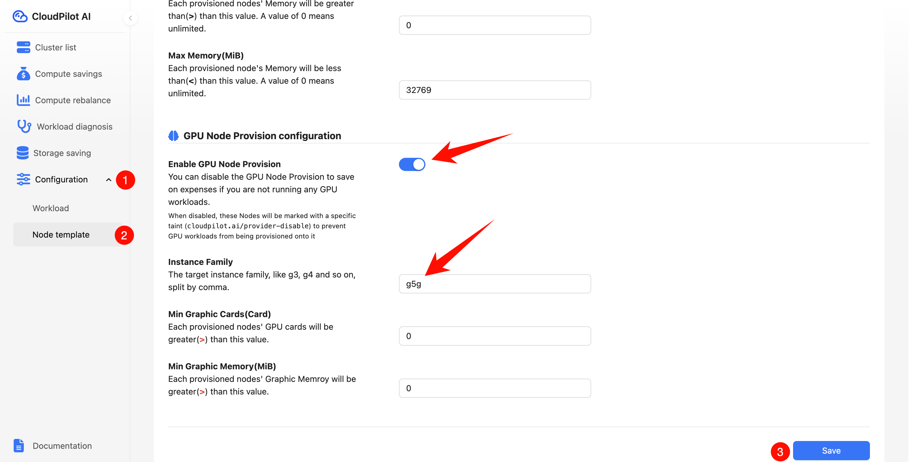
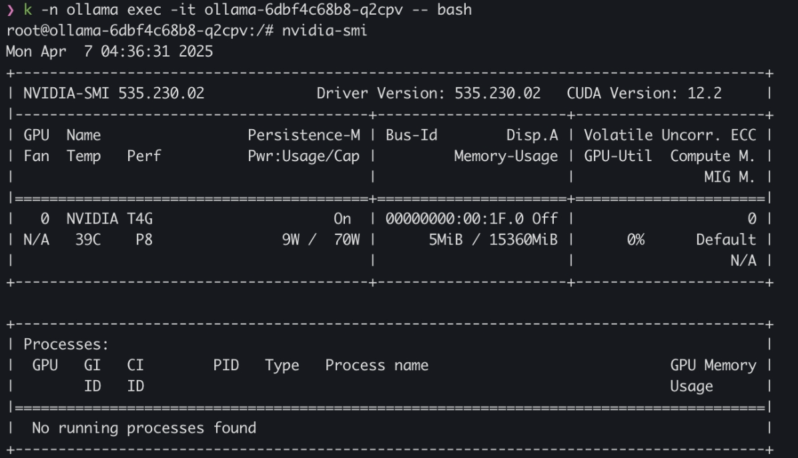

# Overcoming EKS g5g AMI Limitations: Deploying AWS g5g GPU Instances with CloudPilot AI

This guide will help you configure a `g5g` instance to run GPU applications in a CloudPilot AI-managed EKS cluster. `g5g` instances are ARM-based EC2 instances with NVIDIA T4G Tensor Core GPUs suitable for graphics and machine learning workloads.

## Pre-requirements
⚠️ The following conditions must be met:

1. AWS Target Region `g5g` Instance Quota ≥ 4 vCPUs
2. Container image support for linux/arm64 architecture

## User-Operated part

### GPU Node Provision configuration

1. Login (CloudPilot Console) [https://console.cloudpilot.ai]
2. Go to Target Cluster >> Configuration >> Node Provisioning
3. Configuration `GPU Node Provision configuration`
    - Enable GPU Node Provision
    - Instance Family Add Configuration `g5g`
    - Save Configuration



### Contact the CloudPilot AI Technical Support Team

> We will open up EKS self-access for `g5g` instances in a later iteration, but if you need to use this feature now, please contact CloudPilot AI technical support team to complete the professional configuration!

[Discord](https://discord.gg/WxFWc87QWr)

### Verify Configuration

As an example of deploying the ollama image, create a Deployment in the EKS cluster and use a `g5g` instance to run that Deployment with `nvidia-smi`.

```bash
cat <<EOF | kubectl apply -f -
apiVersion: v1
kind: Namespace
metadata:
  name: ollama
---
apiVersion: apps/v1
kind: Deployment
metadata:
  name: ollama
  namespace: ollama
spec:
  strategy:
    type: Recreate
  selector:
    matchLabels:
      name: ollama
  template:
    metadata:
      labels:
        name: ollama
    spec:
      containers:
      - name: ollama
        image: ollama/ollama:latest
        env:
        - name: PATH
          value: /usr/local/nvidia/bin:/usr/local/cuda/bin:/usr/local/sbin:/usr/local/bin:/usr/sbin:/usr/bin:/sbin:/bin
        - name: LD_LIBRARY_PATH
          value: /usr/local/nvidia/lib:/usr/local/nvidia/lib64
        - name: NVIDIA_DRIVER_CAPABILITIES
          value: compute,utility
        ports:
        - name: http
          containerPort: 11434
          protocol: TCP
        resources:
          limits:
            nvidia.com/gpu: 1
      tolerations:
      - key: nvidia.com/gpu
        operator: Exists
        effect: NoSchedule
---
apiVersion: v1
kind: Service
metadata:
  name: ollama
  namespace: ollama
spec:
  type: ClusterIP
  selector:
    name: ollama
  ports:
  - port: 80
    name: http
    targetPort: http
    protocol: TCP
EOF

kubectl -n ollama exec -it ollama-6dbf4c68b8-q2cpv -- bash

nvidia-smi
```



> 📌 Note: If you see a `No devices found` error, check that the node has the NVIDIA driver loaded correctly!

## Summary

With the above steps, users can successfully run GPU applications with `g5g` instances in CloudPilot AI-managed EKS clusters. Please note that some complex configurations currently require support team assistance but will be simplified for users in future releases.
