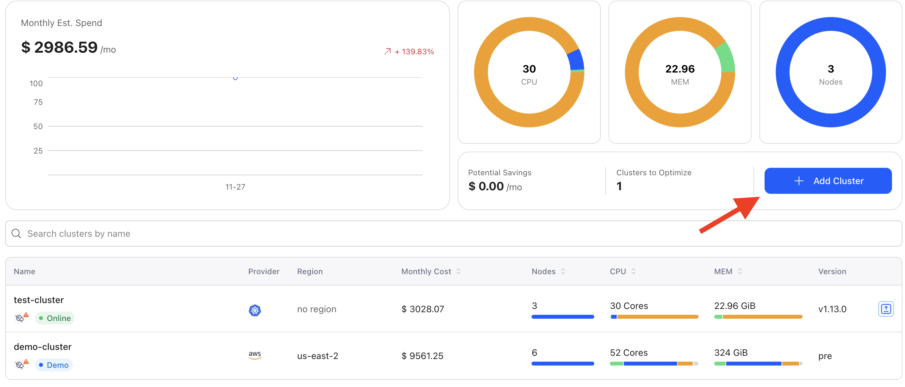
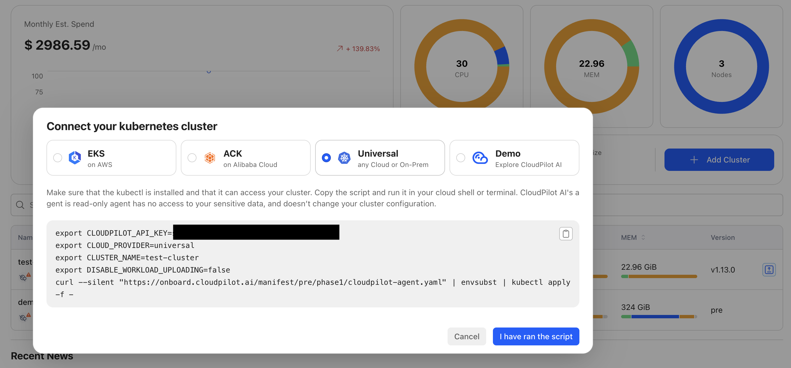
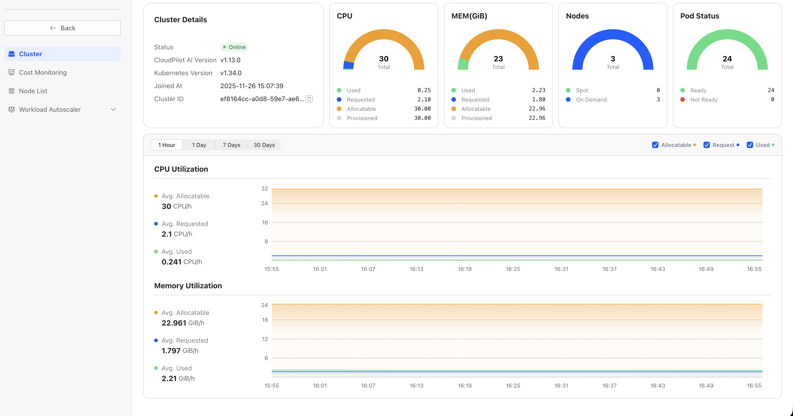
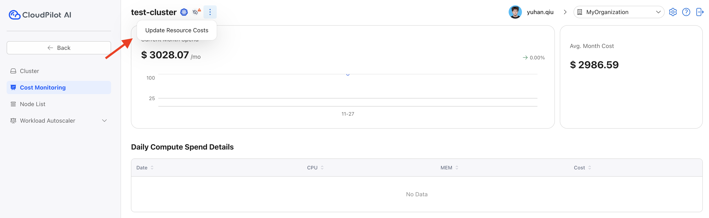
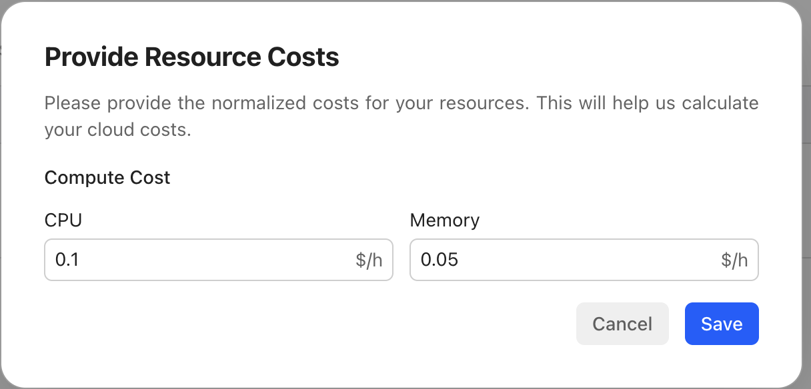

# Getting Started with CloudPilot AI Universal

This document provides a step-by-step guide to deploying and optimizing a cluster with CloudPilot AI Universal.
It covers cluster connection to the CloudPilot AI console, compute cost customization, and Workload Autoscaler installation.

## Prerequisites

- A Kubernetes cluster (any distribution, including on-premises or other public cloud providers)
- `kubectl` installed and configured to access your cluster
- Access to the [CloudPilot AI console](https://console.cloudpilot.ai)

## Step 1: Connect Your Cluster to CloudPilot AI

After logging into the [CloudPilot AI console](https://console.cloudpilot.ai), perform the following:

1. Click **Add Cluster**.
2. Select **Universal** as the deployment mode.
3. Enter the name of your cluster.
4. Copy and execute the provided shell command in your terminal.

  

    
  

  

    
  

After executing the script:

1. Click **I ran the script**.
2. Click the selected cluster, navigate to the **Cluster** tab, and view the cluster information.

  

    
  

## Step 2: Customize Compute Cost

To enable accurate cost monitoring and optimization recommendations, you need to configure the compute cost for your cluster nodes.
This helps CloudPilot AI calculate potential savings and provide accurate cost insights.

1. Navigate to the **Cost Monitoring** tab in your cluster dashboard.
2. Click **Update Resource costs**.
3. Enter the hourly cost for CPU and Memory:
   - **CPU cost per hour**: The cost per CPU core per hour
   - **Memory cost per hour**: The cost per GiB of memory per hour

  

    
  

  

    
  

After configuring the compute costs, CloudPilot AI will be able to display real-time cost monitoring for your cluster.

## Step 3: Install Workload Autoscaler

The Workload Autoscaler automatically adjusts pod resource requests and limits based on actual usage patterns. 

For detailed installation instructions, including Prometheus requirements and configuration steps, see the [Workload Autoscaler Installation](/guide/workload_autoscaler/installation) guide.
