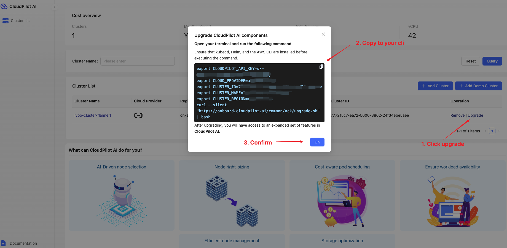

# Upgrade Guide

## Purpose

This document provides a comprehensive, step-by-step guide to upgrading the CloudPilot AI system. It is intended for DevOps engineers, platform operators, and system administrators who manage CloudPilot AI deployments in Kubernetes environments, enabling them to benefit from the latest enhancements.

## Prerequisites Before Upgrade

Before proceeding with the upgrade, please ensure that your current CloudPilot AI version supports the upgrade. You can log in to the [CloudPilot AI Console](https://console.cloudpilot.ai) to check your version. If your version is outdated, follow the steps below to upgrade.

## Effect of the Upgrade Script

The upgrade script will perform the following actions on the CloudPilot AI components:

#### 1. Version Check and Upgrade
The script first checks the version of the currently deployed `cloudpilot-agent`. If the current version is already up to date, it will notify you that no upgrade is necessary and terminate the upgrade process. If the version is not the latest, the script will automatically upgrade CloudPilot AI to the specified latest version. If your current version is outdated, the script will perform a step-by-step upgrade to the target version, ensuring that no minor versions are skipped.

#### 2. Upgrading Components
CloudPilot AI consists of multiple components, mainly divided into two phases:
- **Phase 1**: The core agent, deployed in the `cloudpilot` namespace;
- **Phase 2**: Scheduling and optimization components installed via Helm.

The script will automatically check if Phase 1 and Phase 2 components are already installed in the cluster:
- If Phase 2 is already present, the script will automatically run the remote Phase 2 installation script;
- Regardless of whether Phase 2 is installed, the script will always apply the Phase 1 manifest YAML file to ensure the core agent is updated to the latest version.

#### 3. Resource Fetching
The script will use `curl` to fetch the following resources for the corresponding version:
- Phase 2 installation script;
- Phase 1 manifest YAML file.

These resources will be applied to your cluster automatically to complete the upgrade.

#### 4. Pod Status Check
After the upgrade, the script will wait for all the pods in the `cloudpilot` namespace to be in the `Ready` state. If any pod fails to start, the script will wait up to 10 minutes to ensure that all components are correctly running. If the pods are still not ready after 10 minutes, the script will terminate and report an error.

#### 5. Dependency Requirements
Before running the script, please ensure that the following tools are installed on your system:
- `kubectl`: for interacting with your Kubernetes cluster;
- `helm`: for managing Kubernetes applications;
- `curl`: for fetching remote resources.

Additionally, you will need to provide the CloudPilot API key as an environment variable `CLOUDPILOT_API_KEY`.

#### 6. No Effect on Other Resources
The upgrade will only affect resources within the `cloudpilot` namespace. Other namespaces or resources in your cluster will remain unaffected. During the upgrade, existing nodes and workloads will continue running without disruption.

## Upgrade Steps

### Step 1. Fetch the Latest Upgrade Script

Visit the [CloudPilot AI Upgrade Page](https://console.cloudpilot.ai) to download the latest upgrade script. Choose the appropriate script version based on your cluster environment.

### Step 2. Execute the Upgrade Script

Once connected to your CloudPilot AI cluster, open your terminal and execute the downloaded upgrade script. The script will check the current version and perform the upgrade automatically.

### Step 3. Verify the Upgrade

After the upgrade script has completed, you can return to the CloudPilot AI Console to check the status and performance of your cluster. Ensure that all pods and components have successfully started and are running properly.

By following these steps, your CloudPilot AI will be successfully upgraded to the latest version, benefiting from the newest optimizations and features. And please feel free to contact us if you have any questions or concerns.