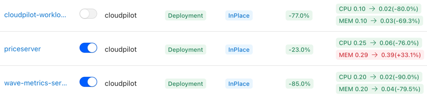
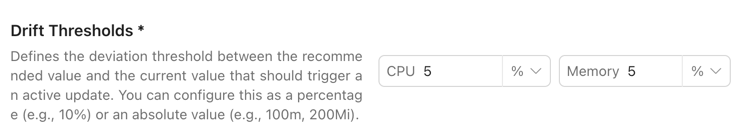
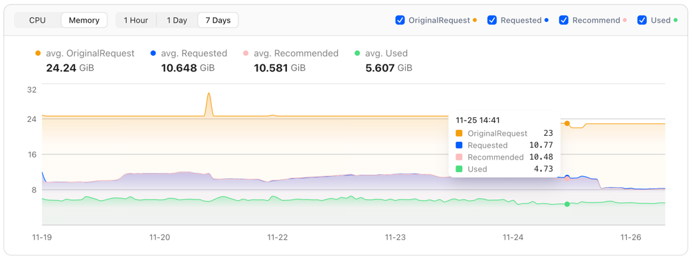
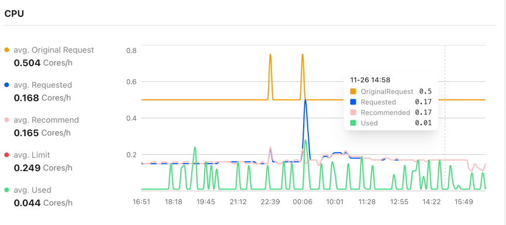
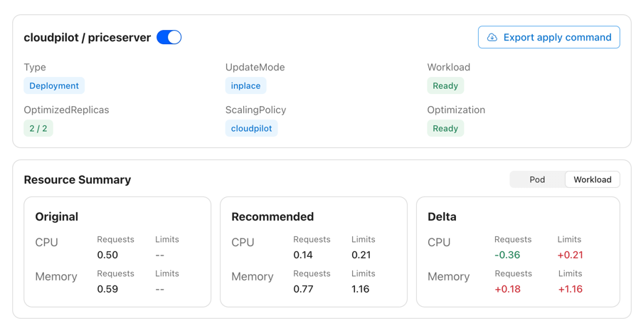
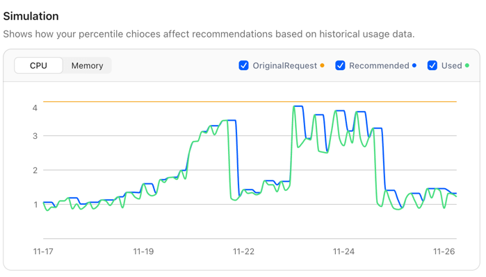
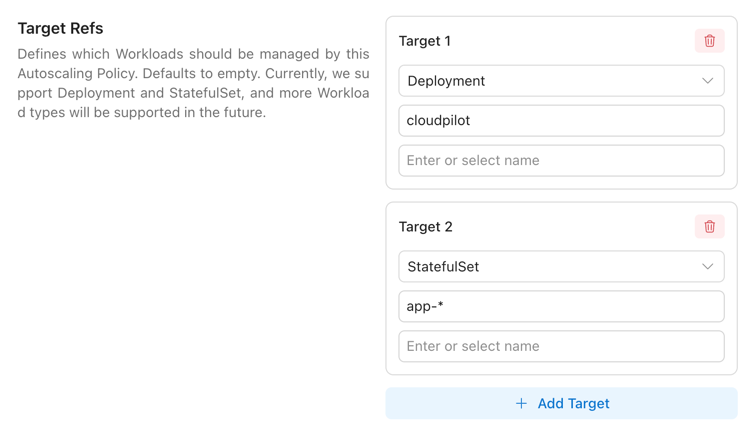

# Overview

The **Workload Autoscaler** component automatically works in tandem with our **Node Autoscaler**, dynamically adjusting the requests and limits of all your workloads — scaling them up or down as needed. This ensures that both your workloads and your cluster operate at the optimal balance between **performance** and **cost**.

It continuously reduces unnecessary expenses, boosts workload performance, and frees your team from the burden of manual resource tuning — allowing you to focus on innovation and creating real business value.

## Features

Workload Autoscaler currently supports the following capabilities:

### Enhanced Optimization Rate Control

We provide multi-dimensional rate-control mechanisms for proactively optimizing (Evict & ReCreate) workloads:

- **Update Time Window**: You can configure the specific time periods during which the Workload Autoscaler is allowed to perform optimizations, ensuring that no updates occur during peak business hours. For detailed configuration, see [here](./autoscaling_policy#update-schedule).

- **Global Update Rate Control**: You can configure a global environment variable to control how many proactive update operations the Workload Autoscaler is allowed to perform within each time window. For detailed configuration, see [here](./installation#configure-the-updateevict-limiter).

| ENV var                    | Default | What it controls                                                               |
|----------------------------|---------|--------------------------------------------------------------------------------|
| `LIMITER_QUOTA_PER_WINDOW` |   **5** | Tokens added to the bucket each window.                                        |
| `LIMITER_BURST`            |  **10** | Maximum tokens allowed in the bucket (peak operations within a window).        |
| `LIMITER_WINDOW_SECONDS`   |  **30** | Window length in seconds; every window adds `LIMITER_QUOTA_PER_WINDOW` tokens. |

- **Gradually Enable Workload Optimization**: After connecting your cluster, you can progressively enable proactive optimization for each workload. This allows you to safely and controllably bring all workloads under the management of the Workload Autoscaler.

- **Drift Control**: You can configure [DriftThresholds](./autoscaling_policy#drift-thresholds) in the AutoscalingPolicy. DriftThresholds define how much deviation is allowed between the recommended values and the current resource configuration before an optimization action is triggered.

### Visualization

Most existing open-source VPA solutions fail to provide a high-quality visualization interface, leaving users unable to clearly understand the value that VPA brings to a specific workload or to the entire cluster.
CloudPilot AI addresses this gap by offering a powerful visual dashboard that helps you easily track each workload’s resource usage and the historical changes of its recommendations.

In addition, you can examine optimization details from both the Pod and Workload perspectives, including recommendation history and real resource usage trends.

### Flexible Recommendation Settings

In most existing VPA-style products, users can configure only a limited subset of the key variables that influence recommendations.
CloudPilot AI aims to maximize the number of workload types that can be optimized, so we expose **almost all configuration options**.

By defining a **RecommendationPolicy**, you can flexibly control how recommendations are calculated — including Buffer, History Window, Resource Limits, Evaluation Period, and more.
For detailed configuration instructions, see [here](./recommendation_policy).

At the same time, we recognize that users may not fully understand the impact of each setting.
To address this, CloudPilot AI provides a **Simulation** feature that visually demonstrates how changes to each configuration parameter affect the final recommendation, helping users better understand the meaning and effect of each option.

### Better Limit Management

Beyond adjusting workload **Requests**, CloudPilot AI also supports adjusting **Limits**.
Limit adjustments are more serious because they directly impact Pod stability and cluster-level resource allocation.
To give you finer control, CloudPilot AI allows you to configure how Limits should behave through the **AutoscalingPolicy**.

We currently support **three LimitPolicy modes**:

- **Remove all Limits**
- **Keep Limits unchanged**
- **Maintain a proportional relationship with Requests**

For detailed configuration, see [here](./autoscaling_policy#limit-policy).

### InPlace Update Support

**InPlace Update** allows updating workload Requests/Limits *without recreating Pods*, minimizing the impact on running applications.
This feature officially entered **Beta** in Kubernetes **v1.33** and is enabled by default.

However, InPlace Update still comes with several limitations.
For example:

- It disallows operations that would change a Pod’s QoS class
- Memory Limits cannot be decreased
- Other API-level validation constraints

CloudPilot AI provides enhanced and safer support for InPlace Update inside the Workload Autoscaler.

More details are available [here](./inplace_update_mode_best_practices_and_limitations).

### Configure Everything in 3 Minutes

We understand the pain of configuring hundreds of workloads individually.
That’s why CloudPilot AI offers an extremely simple setup process—**just 3 minutes** to fully configure workload optimization across your entire cluster.

By default, CloudPilot AI provides:

- **3 built-in RecommendationPolicies**
- **A default AutoscalingPolicy**

You simply choose the RecommendationPolicy that suits your workloads, then use AutoscalingPolicy to select which workloads should be optimized.

We support selecting workloads flexibly via **WorkloadKind**, **Namespace**, or **wildcards**.
See details [here](./autoscaling_policy#targetrefs).

You may define **multiple AutoscalingPolicies** to map different workloads to different optimization strategies.
You can even rely on a single default AutoscalingPolicy to target *all* workloads, and then override specific workloads using Policies with higher **Priority**.

## Supported Workload Types

CloudPilot AI Workload Autoscaler supports optimization for the following Kubernetes workload types:

| Workload Type | Supported   | Supported Update Modes      |
|---------------|-------------|-----------------------------|
| Deployment    | Yes         | OnCreate, ReCreate, InPlace |
| StatefulSet   | Yes         | OnCreate, ReCreate, InPlace |
| DaemonSet     | In Progress | OnCreate, InPlace           |
| Rollout       | In Progress | OnCreate, ReCreate, InPlace |

## RoadMap

You can view the planned features for upcoming versions of the Workload Autoscaler [here](../roadmap).
